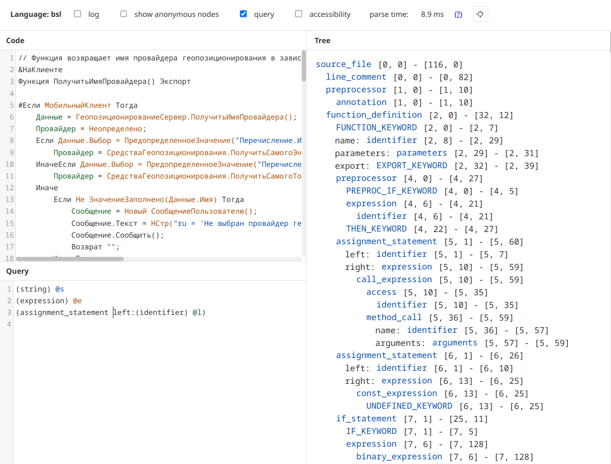

# tree-sitter-bsl

[![CI][ci]](https://github.com/alkoleft/tree-sitter-bsl/actions/workflows/ci.yml)
[![npm][npm]](https://www.npmjs.com/package/tree-sitter-bsl)
[![crates.io][crates]](https://crates.io/crates/tree-sitter-bsl)
[![PyPI][pypi]](https://pypi.org/project/tree-sitter-bsl/)

Грамматика 1C (BSL) Language в формате [tree-sitter](https://github.com/tree-sitter/tree-sitter).

[Попробовать](https://alkoleft.github.io/tree-sitter-bsl/)



## Использование

### Rust

Добавьте зависимость в [`Cargo.toml`](Cargo.toml):

```toml
[dependencies]
tree-sitter = "0.25"
tree-sitter-bsl = "0.1"
```

```rust
use tree_sitter::Parser;

fn main() {
    let mut parser = Parser::new();
    parser
        .set_language(&tree_sitter_bsl::LANGUAGE.into())
        .expect("Error loading BSL grammar");

    let source = r#"
        Процедура Привет()
            Сообщить("Привет, мир!");
        КонецПроцедуры
    "#;

    let tree = parser.parse(source, None).unwrap();
    println!("{}", tree.root_node().to_sexp());
}
```

### Node.js

Установите пакет:

```sh
npm install tree-sitter-bsl tree-sitter
```

```js
const Parser = require("tree-sitter");
const BSL = require("tree-sitter-bsl");

const parser = new Parser();
parser.setLanguage(BSL);

const sourceCode = `
Процедура Привет()
    Сообщить("Привет, мир!");
КонецПроцедуры
`;

const tree = parser.parse(sourceCode);
console.log(tree.rootNode.toString());
```

### Python

Установите пакет:

```sh
pip install tree-sitter-bsl tree-sitter
```

```python
import tree_sitter_bsl as tsbsl
from tree_sitter import Language, Parser

BSL_LANGUAGE = Language(tsbsl.language())
parser = Parser(BSL_LANGUAGE)

source = """
Процедура Привет()
    Сообщить("Привет, мир!");
КонецПроцедуры
""".encode()

tree = parser.parse(source)
print(tree.root_node.sexp())
```

## References

- Грамматика основана на правилах [BSL Parser](https://github.com/1c-syntax/bsl-parser)

[ci]: https://img.shields.io/github/actions/workflow/status/alkoleft/tree-sitter-bsl/ci.yml?logo=github&label=CI
[npm]: https://img.shields.io/npm/v/tree-sitter-bsl?logo=npm
[crates]: https://img.shields.io/crates/v/tree-sitter-bsl?logo=rust
[pypi]: https://img.shields.io/pypi/v/tree-sitter-bsl?logo=python
